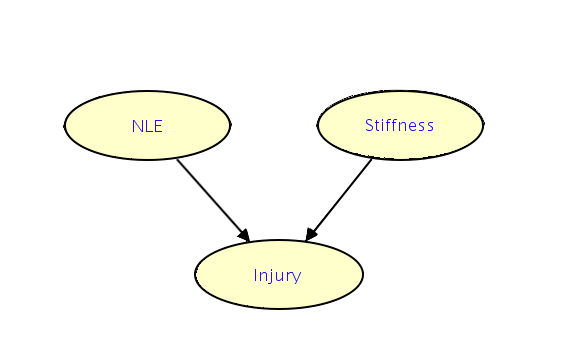
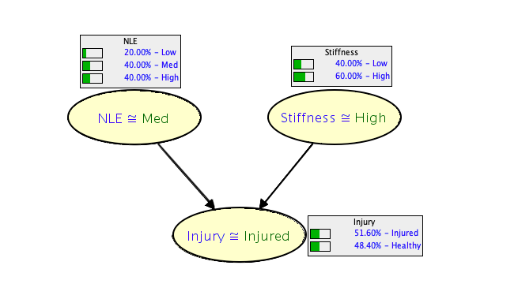
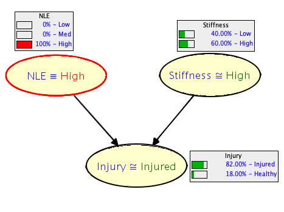
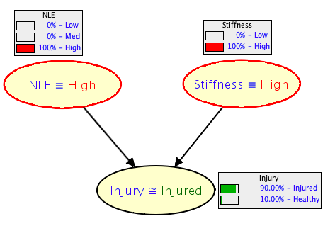
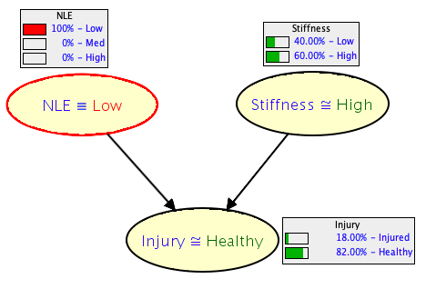
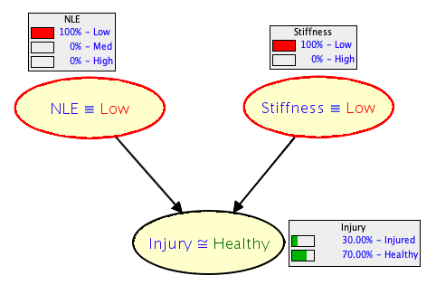

```{r measures-setup, include=FALSE}
knitr::opts_chunk$set(echo = FALSE, fig.align = "center")
pacman::p_load(tidyverse, knitr, papaja, kableExtra)
options(tinytex.verbose = TRUE)
```

In traditional sports injury research, statistical analysis techniques such as correlational analysis and logistic regression are commonly used examine the relationship between predictor variables and injury occurence. 
While easily accessible to most researchers, these techniques have been limited in their ability to successfully identify predictive factors, and are unable to fully account the complex and multifactoral nature of injury occurrence due to their linear and reductionist assumptions.
In contrast to traditional statistical methods used in the sports injury literature, @Bittencourt2016 proposed that analysis methods should take a complex-systems view of the injury problem, and attempt to capture the complex structure among a "web of determinants" (figure \@ref(fig:webofdeterminants)) to fully explore the interconnectivity between several factors and emergent behaviour. 
However, the sports injury literature has yet apply the appropriate analytical techniques to explore the complex system approach suggested by @Bittencourt2016.

```{r webofdeterminants, fig.pos="H", fig.cap= "(A) Web of determinants for an ACL injury in basketball athletes and (B) web of determinants for an ACL injury in ballet dancer. Adapted from Bittencourt et al. (2016).", out.width="100%" }
include_graphics("figs/measures/webod.pdf", auto_pdf = T)
```

One technique that may overcome the limitations of traditional statistical methods is Bayesian Network modelling [@Pearl1988]. 
A BN is a graphical representation of a joint probability distribution among a set of random variables, and provides a statistical model describing the dependencies and conditional independences from empirical data in a visually appealing way [@Olmedilla2018]. 
Formally, a BN is directed acyclic graph (DAG) containing arcs and nodes, where arcs _between_ nodes represent dependence between variables. A simple example is provided in figure \@ref(fig:simplenetwork).
A node is termed a parent of a child if there is an arc directed from the former to the latter [@Pearl1988]. 
The direction of the arc does not necessarily imply causation, and the relationship between variables are often described as dependent instead of casual [@Scutari2014].
Recently, BNs have been used within the sports psychology literature in a complimentary way to traditional statistics to create graphical probabilistic models based on the complex underlying structure that connects the variables of interest [@Fuster-Parra2017; @Fuster-Parra2014], however few studies have applied this approach to sports injury research [@Olmedilla2018].

```{r simplenetwork, fig.cap="In this simple network injury status is shown to depend on both negative life events (NLE) and muscle stiffness. Research suggests that high negative life event stress is a strong predictor of injury, whereas the relationship between muscle stiffness and injury is less established.", out.width="80%" }

```

<!-- Given the potentially complex relationship between psychological factors and markers of training related stress in the current research, a BN model may provide new insights into the interaction between different varibales and their relationship to sports injury.  -->

## Example of building a network

The following sections provide an example of how a hypothetical BN could be constructed and used to examine the relationship between factors associated with sports injury, and describe three main step in BN modelling:

1. Data preparation
2. Learning the structure of the BN
3. Using the BN for inference

1. Data preparation

To explore the arcs within a BN model, a variety of different data types can be used, including; multinomial/discrete data, continuous data, and combination of both multinomial and continuous data. 
Discrete networks are the most common type of networks studied in the literature and require continuous variables to descretized into categorical variables (e.g., a continuous variable on a scale from 0 - 100 could be categorised as "low" [0-33], "medium" [34-66] and "high" [67-100]).
Break points should be chosen based on relevant to the specific variable, however several techniques such as equal width and equal frequency separation are available if break points are unknown [@Chen2012].
The strength of the relationship between nodes is in discrete model is quantified in the Conditional Probability Tables (CPTs) attached to each node.
Parent nodes who do not depend on any other node are described by prior probability tables (PPTs).
Conditional probabilities for each child node are allocated for each combination of the possible states in their parent nodes.
Therefore, the size of each CPT depends on the number of parent nodes and the number of possible sates for each parent node and therefore increase exponentially:

$$ \text{size(CPT)} = S \prod_{n = i}^n P_i $$

where $S$ = the number of states, $P_i$ = the number of states in the $i$th parent node. 
In figure \@ref(fig:cpts), the number of parameters is calculated as 3 (negative life events states) x 2 (muscle stiffness states) x 2 (injury states) equates to 12 parameters.
Given the exponential relationship with the number of parent node states and CPTs in a BN, care should be taken when descretzing variables, as a large number of states will results in an exponentially large number of model parameters, potentially making the model untractable [@Chen2012].

```{r cpts, out.width="90%", fig.pos="H", fig.cap= "The marginal probabilities for NLE and muscles stiffness and the conditional probability of injury status."}

```

2. Learning the structure of the BN

There are two main approaches to obtain the structure of a network; either supervised or unsupervised learning. 
In supervised learning, the network structure is already "known", and prior knowledge of the system or phenomenon from experts can be used to decide what arcs and nodes should present within the network.
However, often it is the network structure itself that is under study, and unsupervised or data driven methods can be used to learn the structure of the network.
There are three main approaches to unsupervised learning: constraint-based, score-based and a hybrid method of combining both constraint and score-based methods.
Constraint-based algorithms are based on the Inductive Causation (IC) algorithm first proposed by @Pearl1988 and provide a framework for learning the structure of a network using conditional independence tests. 
Score based algorithms are based on network optimisation techniques, where different network structures are evaluated and scored. The algorithm searchers for the network structure that maximises the network score.
Hybrid algorithms combine conditional independence tests, to number of possible networks and network scores, to identify the optimal structure.

3. Using the BN for inference

Once the network has been identified, the structure can be used to to make predictions by updating the BN with new "evidence". 
Different queries can be used to answer questions of interest about the structure of the network. 
For example, _probability queries_ can provide the probability of a particular node state under specific conditions. 
_Conditional independence queries_ can validate the association between two variables after the influence of other variables is removed. 
Finally, _most likely explanation queries_ can identify the most likely states of one or more variables.
To provide an example, our hypothesised network has been fitted with simulated data to enable inference on the network dependencies.
By altering the states of the parent nodes (NLE and Stiffness) we are able to investigate how the probability of the injury status node changes.
Figure \@ref(fig:nlehigh) and figure \@ref(fig:nlestiffhigh) shown the change in probability of being injured when NLE and both NLE and stiffness are fixed to their "High" states.
High major life events has the greatest increase on the probability of being injury in the example. High stiffness also increases probability of being injury by a further 10%. 

```{r nlehigh, out.width="70%", fig.pos="H", fig.cap="NLE fixed to High"}

```

```{r nlehighstiff, out.width="70%", fig.pos="H", fig.cap="NLE and stiffness fixed to High"}

```
In contrast, when life events are "low" the probability of being healthy increases (figure \@ref(fig:nlelow)). However when stiffness is also set to low, probability of being healthy decreases by 20% indicating that "low" stiffness may actually increase probability of being injured, and there is an optimal level of stiffness required to remain healthy (figure \@ref(fig:nlestifflow)).  

```{r nlelow, out.width="70%", fig.pos="H", fig.cap="NLE fixed to \"Low\""}
 
```

```{r nlestifflow, out.width="70%", fig.pos="H", fig.cap="NLE and Stiffness both fixed to \"Low\" "}

```

#### Summary

Only a brief introduction to BNs has been provided and for a more thorough introduction to BN's the reader is referred to @Pearl1988 and @Eugene1991. 
Additionally @Scutari2014 provides an informative introduction for fitting Bayesian models within the R computing environment. The `bnlearn` package by @Scutari2010 is a freely available for the R language, and is capable of fitting multinomial, continuous and hybrid (combination of discrete and continuous) networks using a variety of commonly used algorithms (e.g., search and score, constraint based and hybrid methods).  

\newpage

# References

\begingroup
\setlength{\parindent}{-0.5in}
\setlength{\leftskip}{0.5in}

<div id = "refs"></div>
\endgroup


notes 

## probabilistic reasoning

Model can  be used to answer questions about the nature of the data that go beyond the mere description of the data in the sample.
Use probabilistic reasoning / belief updating, questions called queries
(Pearl 1988 expert systems theory = submit query to an expert to get an opinion who updates your beliefs accordingly) - replaced traditional statistics terminology in recent texts (koller + Friedman)


Soft evidence = new distribution for one or more variables in the network

Maximum a posteriori queries concerned with finding the configuration q* of the varibales in and outcome Q that has the highest posterior probabilty

$MAP(Q|E,B) = q* = \mathop{argmax}_{\textbf{q}} PR(Q = q | E, G, \Theta)$

Logic sampling vs likelihood weighting

Approximate inference - uses Monte Carlo simulations to sample from the global distribution $X$ and estimate 
$Pr(\textbf{Q} | E, G, \Theta)$.
Specifically, they generate a large number of sample form B and estomate the relevant conditional probabilities by weighting the samples that include both E and Q = q against those that only include E. 
Random smaples know as articles and algorithms that make use of them are known as particle filters / particle based methods

Logic sampling = rejection smapling with uniform weights

Improvement = 
Likelihood weighting generates random observations in such as way that all of them match the evidence, and reweights them appropriately when computing the conditional probability for the query.
Sample from a mutilated netowrk where nodes are fixed.

Weights adjust for the fact that we are sampling from mutilated network

boot.strength() estimates the strength of each arc as its empirical frequency over a set of networks learned from bootstrap samples. It computes the probability of each arc (modulo its direction) and the probabilities of each arc's directions conditional on the arc being present in the graph (in either direction).
